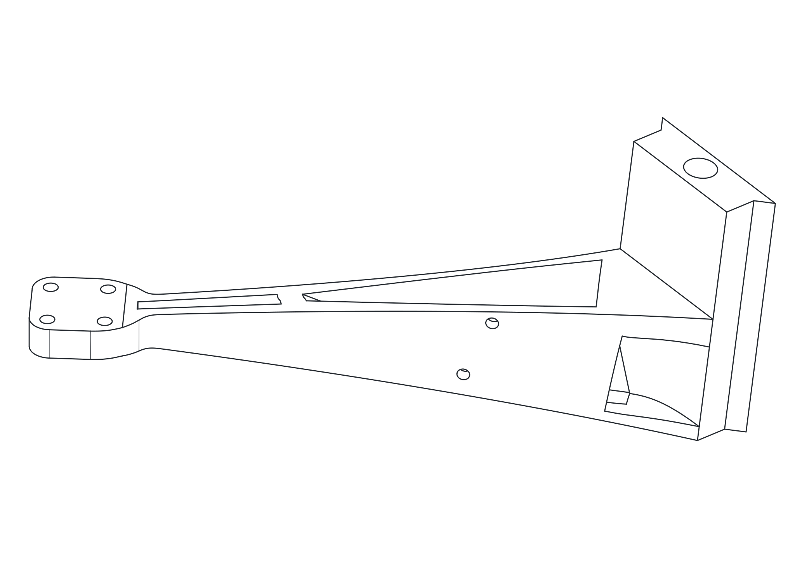

# ESC on Wing

[Back to project index](../../README.md)

## Views

### Front View

  <picture>
    <source media="(prefers-color-scheme: dark)" srcset="./assets/front-view-dark.svg">
    <source media="(prefers-color-scheme: light)" srcset="./assets/front-view-light.svg">
    
  </picture>

### Rear View

  <picture>
    <source media="(prefers-color-scheme: dark)" srcset="./assets/rear-view-dark.svg">
    <source media="(prefers-color-scheme: light)" srcset="./assets/rear-view-light.svg">
    
  </picture>

## Description

Replace this placeholder with the final description for the ESC-on-wing part or assembly.

Suggested content to add later:

- Why the ESC is mounted in this location
- Cable routing, clearance, or airflow notes
- Assembly or service considerations

## Assets

- Theme-aware previews: `./assets/front-view-light.svg`, `./assets/front-view-dark.svg`, `./assets/rear-view-light.svg`, `./assets/rear-view-dark.svg`
- Original source drawings: `./assets/front-view-source.svg`, `./assets/rear-view-source.svg`
