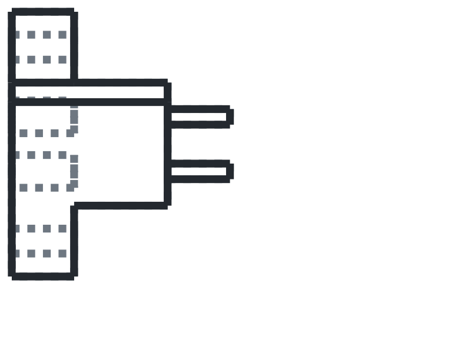
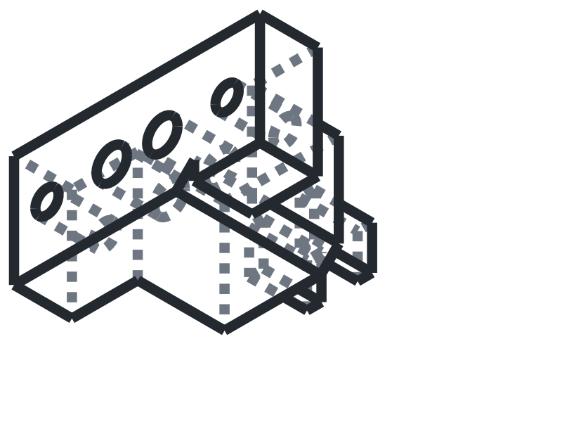
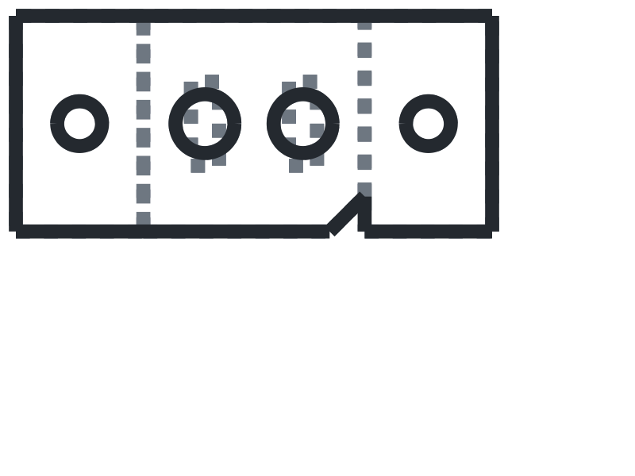

# Female Connector

[Back to project index](../../README.md)

## Views

### Front View

  <picture>
    <source media="(prefers-color-scheme: dark)" srcset="./assets/front-view-dark.svg">
    <source media="(prefers-color-scheme: light)" srcset="./assets/front-view-light.svg">
    
  </picture>

### Isometric View

  <picture>
    <source media="(prefers-color-scheme: dark)" srcset="./assets/isometric-view-dark.svg">
    <source media="(prefers-color-scheme: light)" srcset="./assets/isometric-view-light.svg">
    
  </picture>

### Top View

  <picture>
    <source media="(prefers-color-scheme: dark)" srcset="./assets/top-view-dark.svg">
    <source media="(prefers-color-scheme: light)" srcset="./assets/top-view-light.svg">
    
  </picture>

## Description

Replace this placeholder with the final description for the female connector.

Suggested content to add later:

- Electrical or mechanical role in the drone
- Mating part and alignment notes
- Installation, cable management, or access notes

## Assets

- Theme-aware previews: `./assets/front-view-light.svg`, `./assets/front-view-dark.svg`, `./assets/isometric-view-light.svg`, `./assets/isometric-view-dark.svg`, `./assets/top-view-light.svg`, `./assets/top-view-dark.svg`
- Original source drawings: `./assets/front-view-source.svg`, `./assets/isometric-view-source.svg`, `./assets/top-view-source.svg`
