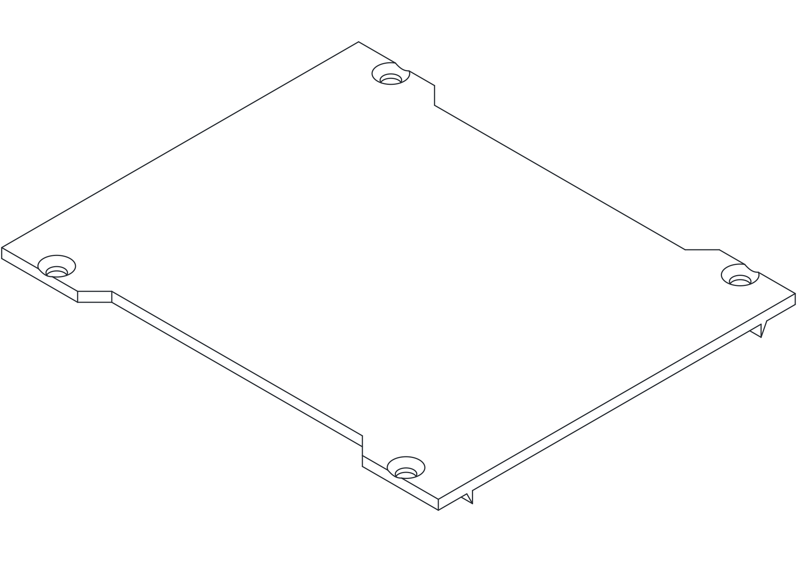

# Frame Lid

[Back to project index](../../README.md)

  <picture>
    <source media="(prefers-color-scheme: dark)" srcset="./assets/drawing-dark.svg">
    <source media="(prefers-color-scheme: light)" srcset="./assets/drawing-light.svg">
    
  </picture>

## Description

Replace this placeholder with the final description for the frame lid.

Suggested content to add later:

- What the lid protects or retains
- Fastener or latch details
- Access and maintenance notes

## Assets

- Theme-aware preview: `./assets/drawing-light.svg` and `./assets/drawing-dark.svg`
- Original source drawing: `./assets/drawing-source.svg`
