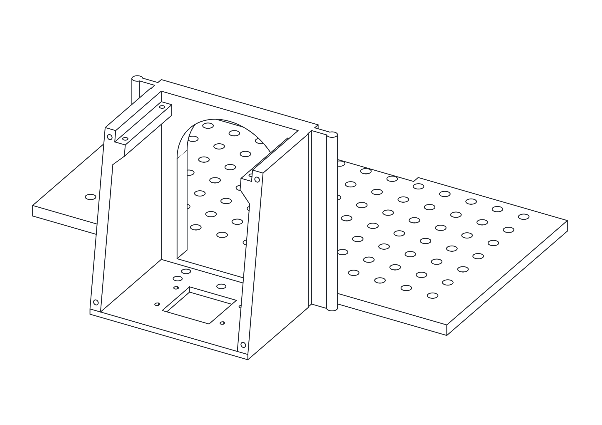

# Front Module Frame

[Back to project index](../../README.md)

  <picture>
    <source media="(prefers-color-scheme: dark)" srcset="./assets/drawing-dark.svg">
    <source media="(prefers-color-scheme: light)" srcset="./assets/drawing-light.svg">
    
  </picture>

## Description

Replace this placeholder with the final description for the front module frame.

Suggested content to add later:

- What lives in or mounts to the front module
- Interface points with the main frame
- Manufacturing and assembly notes

## Assets

- Theme-aware preview: `./assets/drawing-light.svg` and `./assets/drawing-dark.svg`
- Original source drawing: `./assets/drawing-source.svg`
