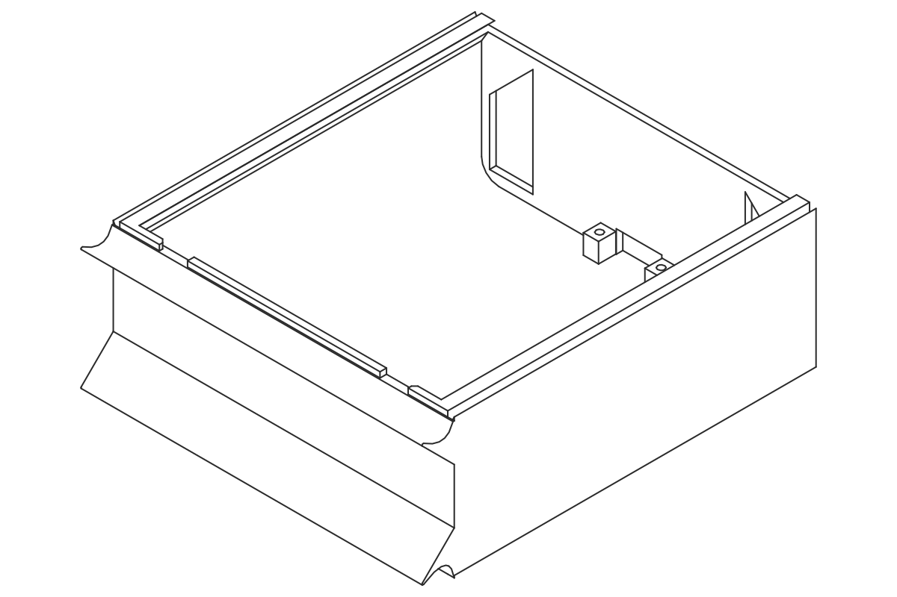
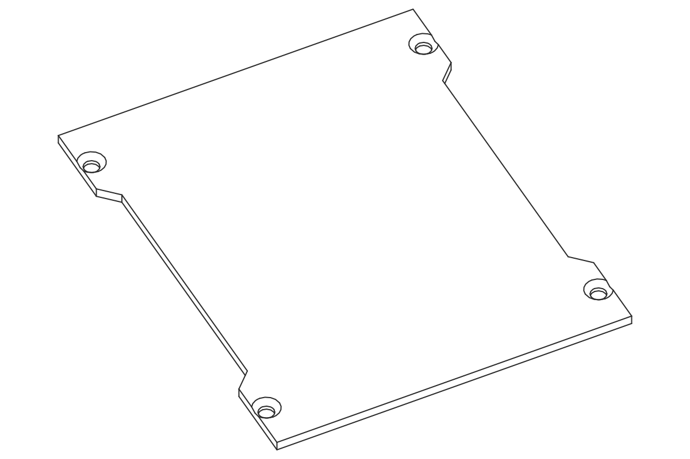

# UglyDrone

Browse the components below. Click any image or name to open the files.

<picture>
  <source media="(prefers-color-scheme: dark)" srcset="./UglyDrone%20--%20Main-dark.svg">
  <source media="(prefers-color-scheme: light)" srcset="./UglyDrone%20--%20Main-light.svg">
  
</picture>

---

## Battery

**[BatteryCase](./BatteryCase)**

<a href="./BatteryCase">
<picture>
  <source media="(prefers-color-scheme: dark)" srcset="./BatteryCase/BatteryCase-dark.svg">
  <source media="(prefers-color-scheme: light)" srcset="./BatteryCase/BatteryCase-light.svg">
  
</picture>
</a>

**[BatteryCaseLid](./BatteryCaseLid)**

<a href="./BatteryCaseLid">
<picture>
  <source media="(prefers-color-scheme: dark)" srcset="./BatteryCaseLid/BatteryCaseLid-dark.svg">
  <source media="(prefers-color-scheme: light)" srcset="./BatteryCaseLid/BatteryCaseLid-light.svg">
  
</picture>
</a>

## Frame & Body

**[Frame](./Frame)**

<a href="./Frame">
<picture>
  <source media="(prefers-color-scheme: dark)" srcset="./Frame/Frame-dark.svg">
  <source media="(prefers-color-scheme: light)" srcset="./Frame/Frame-light.svg">
  
</picture>
</a>

**[Frame Side Panels](./Frame%20Side%20Panels)**

<a href="./Frame%20Side%20Panels">
<picture>
  <source media="(prefers-color-scheme: dark)" srcset="./Frame%20Side%20Panels/Frame%20Side%20Panel%20Left-dark.svg">
  <source media="(prefers-color-scheme: light)" srcset="./Frame%20Side%20Panels/Frame%20Side%20Panel%20Left-light.svg">
  
</picture>
</a>

**[FrameLid](./FrameLid)**

<a href="./FrameLid">
<picture>
  <source media="(prefers-color-scheme: dark)" srcset="./FrameLid/FrameLid-dark.svg">
  <source media="(prefers-color-scheme: light)" srcset="./FrameLid/FrameLid-light.svg">
  
</picture>
</a>

**[FrameLid StarLink](./FrameLid%20StarLink)**

<a href="./FrameLid%20StarLink">
<picture>
  <source media="(prefers-color-scheme: dark)" srcset="./FrameLid%20StarLink/FrameLid%20StarLink%20--%20Main-dark.svg">
  <source media="(prefers-color-scheme: light)" srcset="./FrameLid%20StarLink/FrameLid%20StarLink%20--%20Main-light.svg">
  
</picture>
</a>

## Arms

**[Front Arms](./Front%20Arms)**

<a href="./Front%20Arms">
<picture>
  <source media="(prefers-color-scheme: dark)" srcset="./Front%20Arms/Front%20Left%20Arm-dark.svg">
  <source media="(prefers-color-scheme: light)" srcset="./Front%20Arms/Front%20Left%20Arm-light.svg">
  
</picture>
</a>

**[Rear Arms](./Rear%20Arms)**

<a href="./Rear%20Arms">
<picture>
  <source media="(prefers-color-scheme: dark)" srcset="./Rear%20Arms/Rear%20Left%20Arm-dark.svg">
  <source media="(prefers-color-scheme: light)" srcset="./Rear%20Arms/Rear%20Left%20Arm-light.svg">
  
</picture>
</a>

## Front Control Module

**[Front Control Module](./Front%20Control%20Module)**

<a href="./Front%20Control%20Module">
<picture>
  <source media="(prefers-color-scheme: dark)" srcset="./Front%20Control%20Module/Front%20Module%20--%20Main-dark.svg">
  <source media="(prefers-color-scheme: light)" srcset="./Front%20Control%20Module/Front%20Module%20--%20Main-light.svg">
  
</picture>
</a>

