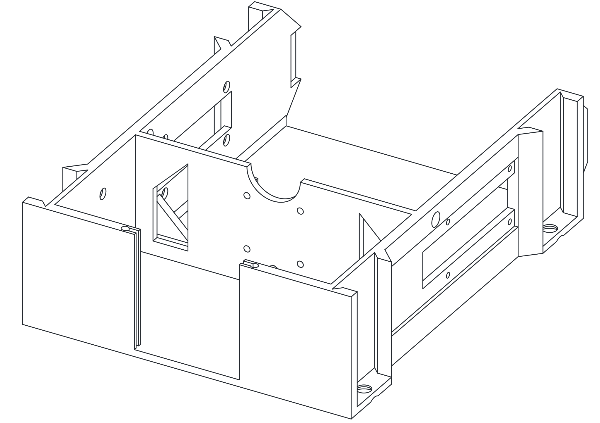
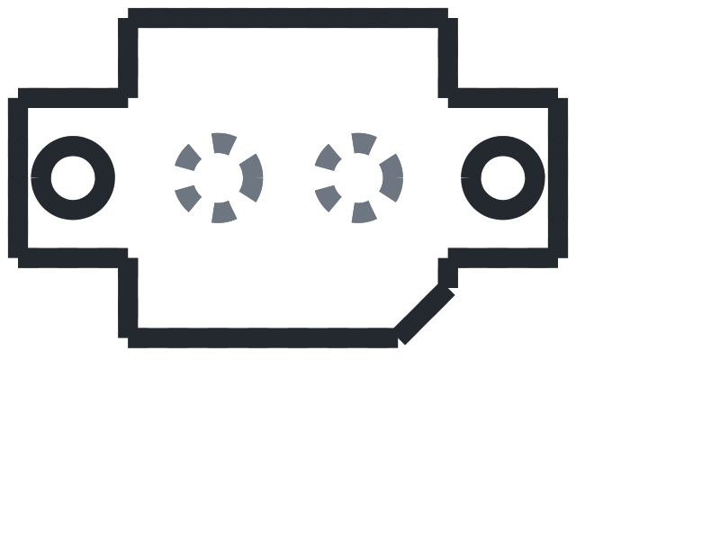

# CAD models and ready-to-print 3D parts for the UglyDrone platform

This repository contains printable parts and reference drawings for the drone project.

  <strong>IMPORTANT</strong> 
  If you want to modify models for your own needs, use <a href="https://cad.onshape.com/documents/f8673177ddbb70b4cac0fd16/w/04bc7065ca4259a18f0d2250/e/3456e933f8e919df9e53002f?configuration=default&renderMode=0&uiState=69b3a248f757ff259edbaccb">this Onshape document</a>.

## Full Assembly

  <picture>
    <source media="(prefers-color-scheme: dark)" srcset="Assembly drawing.svg">
    <source media="(prefers-color-scheme: light)" srcset="Assembly drawing.svg">
    
  </picture>

## Printable Parts

- [Arms](./parts/Arms/)
- [Battery](./parts/Battery/)
- [Command](./parts/Command/)
- [Frame](./parts/Frame/)

## Reference Drawings

The `drone-parts` section adds GitHub-ready drawing pages with SVG previews that stay readable in both light and dark GitHub themes.

- [Battery Module Main Case](./drone-parts/battery-module-main-case/)
- [ESC on Wing](./drone-parts/esc-on-wing/)
- [Frame](./drone-parts/frame/)
- [Frame Lid](./drone-parts/frame-lid/)
- [Front Module Frame](./drone-parts/front-module-frame/)
- [Male Connector](./drone-parts/male-connector/)
- [Female Connector](./drone-parts/female-connector/)

## Drawing Preview Gallery

### [Battery Module Main Case](./drone-parts/battery-module-main-case/)

  <picture>
    <source media="(prefers-color-scheme: dark)" srcset="./drone-parts/battery-module-main-case/assets/drawing-dark.svg">
    <source media="(prefers-color-scheme: light)" srcset="./drone-parts/battery-module-main-case/assets/drawing-light.svg">
    
  </picture>

Placeholder summary: replace this text with the final overview for the battery module main case.

### [ESC on Wing](./drone-parts/esc-on-wing/)

  <picture>
    <source media="(prefers-color-scheme: dark)" srcset="./drone-parts/esc-on-wing/assets/front-view-dark.svg">
    <source media="(prefers-color-scheme: light)" srcset="./drone-parts/esc-on-wing/assets/front-view-light.svg">
    
  </picture>

Placeholder summary: replace this text with the final overview for the ESC-on-wing assembly.

### [Frame](./drone-parts/frame/)

  <picture>
    <source media="(prefers-color-scheme: dark)" srcset="./drone-parts/frame/assets/drawing-dark.svg">
    <source media="(prefers-color-scheme: light)" srcset="./drone-parts/frame/assets/drawing-light.svg">
    
  </picture>

Placeholder summary: replace this text with the final overview for the main frame.

### [Frame Lid](./drone-parts/frame-lid/)

  <picture>
    <source media="(prefers-color-scheme: dark)" srcset="./drone-parts/frame-lid/assets/drawing-dark.svg">
    <source media="(prefers-color-scheme: light)" srcset="./drone-parts/frame-lid/assets/drawing-light.svg">
    
  </picture>

Placeholder summary: replace this text with the final overview for the frame lid.

### [Front Module Frame](./drone-parts/front-module-frame/)

  <picture>
    <source media="(prefers-color-scheme: dark)" srcset="./drone-parts/front-module-frame/assets/drawing-dark.svg">
    <source media="(prefers-color-scheme: light)" srcset="./drone-parts/front-module-frame/assets/drawing-light.svg">
    
  </picture>

Placeholder summary: replace this text with the final overview for the front module frame.

### [Male Connector](./drone-parts/male-connector/)

  <picture>
    <source media="(prefers-color-scheme: dark)" srcset="./drone-parts/male-connector/assets/top-view-dark.svg">
    <source media="(prefers-color-scheme: light)" srcset="./drone-parts/male-connector/assets/top-view-light.svg">
    
  </picture>

Placeholder summary: replace this text with the final overview for the male connector.

### [Female Connector](./drone-parts/female-connector/)

  <picture>
    <source media="(prefers-color-scheme: dark)" srcset="./drone-parts/female-connector/assets/isometric-view-dark.svg">
    <source media="(prefers-color-scheme: light)" srcset="./drone-parts/female-connector/assets/isometric-view-light.svg">
    
  </picture>

Placeholder summary: replace this text with the final overview for the female connector.

## Editing Notes

Replace the placeholder summary text in this file and the `Description` sections inside each part README when you are ready to add the real part documentation.
