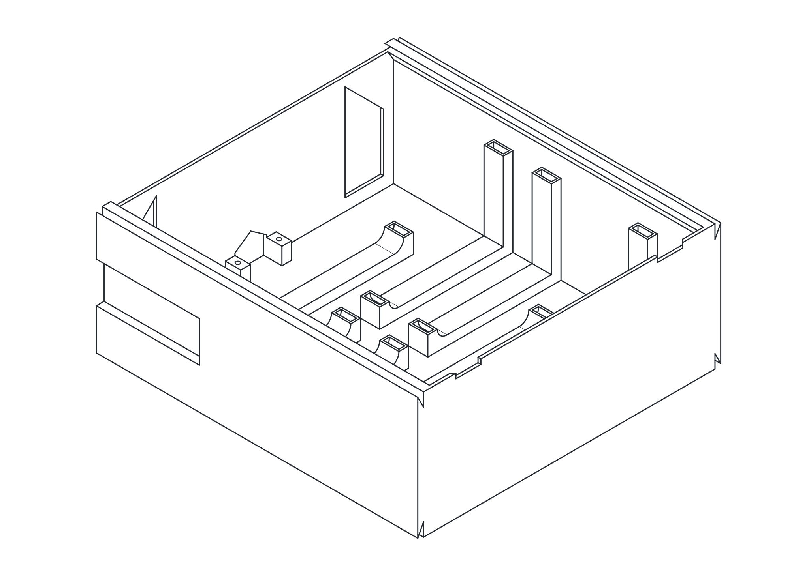

# Drone Models - 3D Print Ready Parts

Welcome to the 3D printable parts repository for the UglyDrone project. We have divided the project into 3 main platforms. Click on any of the platforms below to see its components.

  
  
  

## Full Assembly Reference

  <picture>
    <source media="(prefers-color-scheme: dark)" srcset="assembly-drawing-dark.svg">
    <source media="(prefers-color-scheme: light)" srcset="assembly-drawing-light.svg">
    
  </picture>

